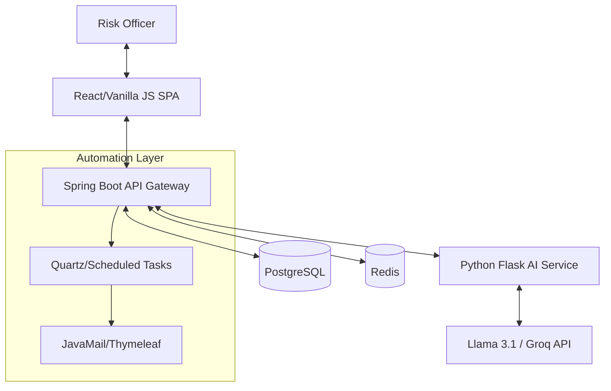

# 🏆 Final Presentation: RiskHeatmap Export Service

## 1. Problem Statement
> "Enterprise risk management today is fragmented. Organizations struggle with manual scoring, stale data, and delayed notifications. This friction leads to **unseen critical risks** and **failed compliance audits**."

**Our Solution**: A centralized, high-fidelity platform that integrates:
- **Automated Risk Scoring** (Heatmap Visualization)
- **AI-Driven Mitigation** (Llama 3.1 Insights)
- **Proactive Notifications** (Automated Email Schedulers)

---

## 2. System Architecture

---

## 3. Demo Flow (6 Minutes)
1. **The Hook (90s)**: Start with the Problem Statement and Architecture.
2. **Live Tool Launch**: Navigate to `http://localhost:8000`.
3. **The Dashboard**: Showcase the **Service Health** and the **Interactive Heatmap**.
4. **CRUD Demo**: 
   - **Create**: Add a new "API Security Vulnerability" risk (Impact: 5, Likelihood: 4).
   - **Delete**: Remove an old "Sample Risk" to show real-time cleanup.
5. **AI Analysis**: Show how the system recommends mitigation for the new risk.
6. **The Export**: Generate a CSV report and show the Audit Log entry.

---

## 4. Final Confidence Check
- [x] CRUD logic implemented in `app.js`.
- [x] Modal UI styled in `style.css`.
- [x] Architecture Mermaid diagram verified.
- [x] Service Health indicators active.
- [x] Data Seeder contains "Demo-Ready" data.
